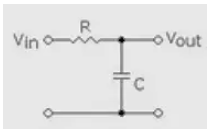

# SuperDial项目介绍

尝试复刻智能旋钮，从该项目中积累关于电机控制的知识、熟悉跨平台编译工具PlatformIO使用，为后续开发工程机械臂自定义控制器做铺垫。
基本目标：熟悉SimpleFOC的使用（后续需要尝试接入ROS）
LVGL界面、ESP32开发等相关知识应当仅作了解。

# 基本概念

## LVGL
开源轻量级显示框架（做GUI的），带lv的变量啥的都是这个框架用到的东西。

LVGL和ESP32主程序跑在两个核心上。

## MQTT

MQTT（Message Queuing Telemetry Transport，消息队列遥测传输协议），是一种基于发布/订阅（publish/subscribe）模式的"轻量级"通讯协议，该协议构建于TCP/IP协议上，以极少的代码和有限的带宽，为连接远程设备提供实时可靠的消息服务。作为一种低开销、低带宽占用的即时通讯协议，使其在物联网、小型设备、移动应用等方面有较广泛的应用。


## C++中奇怪的语法与概念
* `GenericSensor(float (*readCallback)() = nullptr, void (*initCallback)() = nullptr);`：GenericSensor类的构造函数，含两个函数指针（readCallback和initCallback）的参数，这两个函数都是无参函数，返回值分别为float和void，如果没传入指定值默认初始化为nullptr。
* `void init() override;`：表明覆写父类中的虚函数init，不加override也没问题，但是没有成功覆盖的话编译器不会报错。
* `xTaskCreatePinnedToCore(TaskMotorUpdate,"MotorThread",4096,nullptr,2,&handleTaskMotor,ESP32_RUNNING_CORE);`：ESP32特有的创建线程函数，可以指定线程在哪个核心上运行（ESP32是双核的）
* ` typedef void(*FuncCallback_t)(ButtonEvent* btn, int event);`：定义一个函数指针类型，该函数需要一个指针和一个int输入，且该函数无返回值。
* ```C++
  class FileImpl;
  typedef std::shared_ptr<FileImpl> FileImplPtr;
  ```

  定义一个智能指针`FileImplPtr`，指针数据类型为定义的类`FileImpl`

  ```c++
  class File : public Stream
  {
  public:
      File(FileImplPtr p = FileImplPtr()) : _p(p) {
          _timeout = 0;
      }
  }
  ```

  定义类`File`的构造函数，参数`p`的类型是`FileImplPtr`，如果没有给p传递值，默认为`FileImplPtr()`，即空指针。

* ```C++
  void Accounts_Init()
  {
  #define ACT_DEF(NodeName, bufferSize)\
      Account* act##NodeName = new Account(#NodeName, &dataCenter, bufferSize);
  
  #include "_ACT_LIST.inc"
  
  #undef ACT_DEF
  
  #define ACT_DEF(NodeName, bufferSize)\
  do{\
      extern void _ACT_##NodeName##_Init(Account* account);\
      _ACT_##NodeName##_Init(act##NodeName);\
  }while(0)
  
  #include "_ACT_LIST.inc"
  
  #undef ACT_DEF
  }
  
  ```

  * 在函数中进行宏定义操作，其中`##`在宏定义中起“连接”的作用，将变量`NodeName`和前面的字符串`act`连接，形成可以随参数变化的变量名。

  * 而后`#include "_ACT_LIST.inc"`是template中的特殊文件，既非.h也非.c，是生成一组class或function的东西，给template生成代码。段落代码中包含一连串调用前面宏定义`ACT_DEF`的代码，后面也以同样的方式调用了该文件，可以减少重复代码量。
## 电机相关概念
* KV：电压每升高1伏，电机转速增加的数值

* 低通滤波器时间常数Tf：即低通滤波器中$\tau=RC$，其中低通滤波器传递函数为$T(s)=\frac{\tau}{\tau+s}$。反映了电路对输入信号的响应速度。时间常数越大，电路越平滑，但也越不灵敏。时间常数越小，电路越灵敏，但也越不平滑。

  

* FOC

  * 

    三相电压`a-b-c`经过`Clark`变换转为固定坐标`α-β`，通过`park`变换为旋转坐标系`q-d`。此时`q-d`坐标系下跟踪量是线性的，可以用经典控制理论跟踪。通过`RevPark`转换回`α-β`，再通过`SVPWM`转为三相下基电压的占空比来控制电机。

  * 


## ESP32相关

* `Preference`：对于传统的单片机来说我们如果要固化保存小批量的数据的话通常会使用EEPROM，在Arduino core for the ESP32中也有相关的功能。不过对于ESP32来说官方还提供了一种叫做 Preferences 的功能，这个功能也可以用来固化保存数据，并且使用上比EEPROM更加方便。ESP32官方在Flash上建立了分区nvs，Preference数据以（key-value）的方式存储。
* `NeoPixel`：一个支持单引脚寻址的LED灯带

# Init.cpp


# Nvs.cpp
* 初始化时为什么要使用key记录value值，还有一步把value值赋给结构体参数？(set_lcd_bk_brightness)

